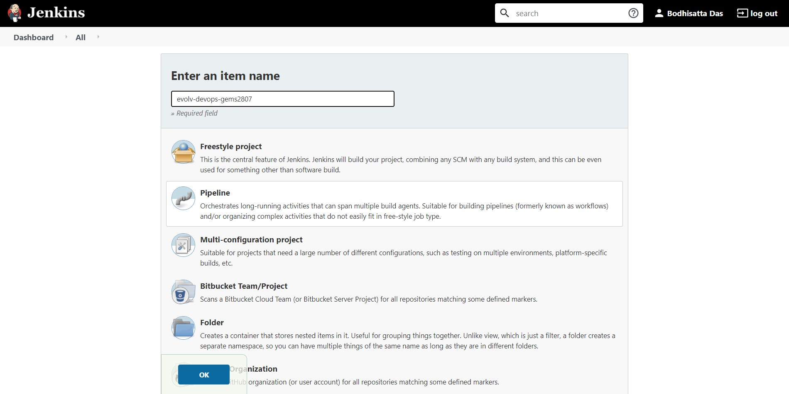
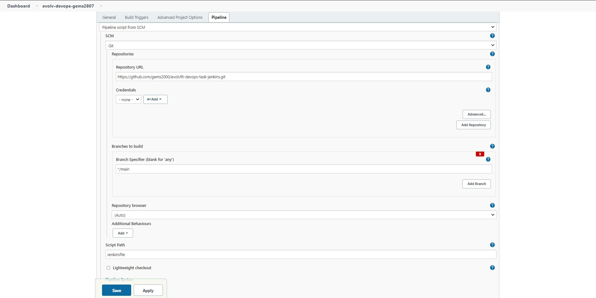
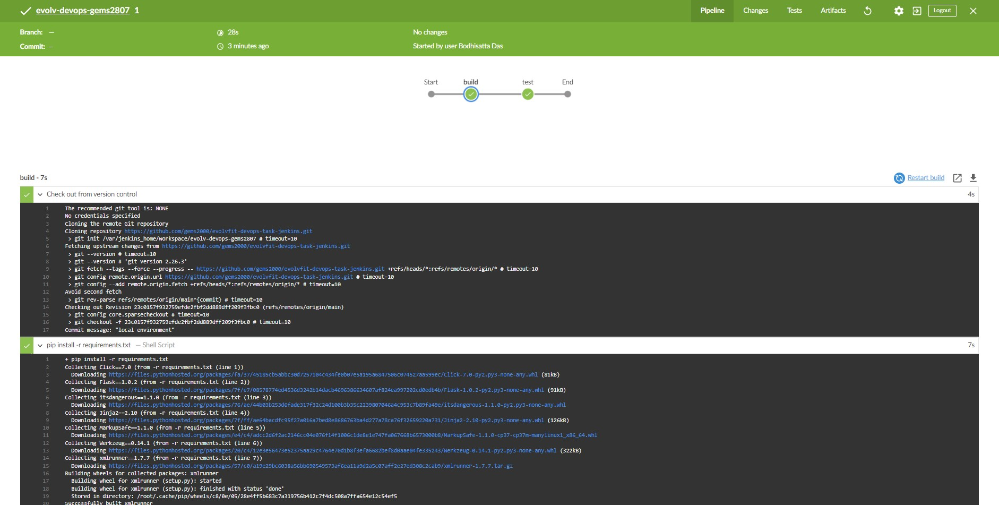

# **EvolvFit DevOps Challenge**
The task was to create ***Jenkins Pipeline*** with a line-by-line explanation. I have created a sample ***Flask*** web app for the development pipeline demonstration in ***Jenkins***. 
## **Prerequisites**

You need to have a functional Python 3 environment to run this project. I recommend [pyenv](https://github.com/pyenv/pyenv) and [pyenv-virtualenv](https://github.com/pyenv/pyenv-virtualenv).

After you can download and install the python modules into a segregated virtualenv.

```bash
# install python and create virtualenv
## NOTE: pcre grep requires GNU grep, e.g. grep -oP
LATEST_PYTHON3=$(
 pyenv install --list | tr -d ' ' | grep -oP '^3\.*\d+\.\d+$' | sort -V | tail -1
)

pyenv install $LATEST_PYTHON3
pyenv virtualenv $LATEST_PYTHON3 evolvfit-devops-task-jenkins
# change to virtualenv
cd .
# update pip module
pip install --upgrade pip
```

## **Running the Application**

These instructions and scripts have been tested on Windows / WSL with Python installed.

### **Test using Python**

```bash
# Install Required Packages
pip install -r requirements.txt
# Run Server
./app.py &
# Manually Test
curl -i localhost:5000/
curl -i localhost:5000/hello/gems2807
```

### **Using Docker Compose**

```bash
# Start containerized service on Docker
docker-compose up -d
# Determine Guest is native Docker, Docker-Machine or Docker-Desktop
[ -z ${DOCKER_MACHINE_NAME} ] || WEBSERVER=$(docker-machine ip ${DOCKER_MACHINE_NAME})
WEBSERVER=${WEBSERVER:-localhost}
# Manually Test
curl -i $WEBSERVER:5000/
curl -i $WEBSERVER:5000/hello/gems2807


## **Running Automated Tests**

```bash
./test.py
```
**Running A Job in Jenkins**
I'm assuming, we have a system preinstalled with **Docker Desktop** as well as **Jenkins** (haha perfect world xD).

 - Bring up the environment by simply typing: `docker-compose up`. This will print out the initial password we can use to bring up an environment.
 - Once logged in, you can now create the initial [**Jenkins**](https://jenkins.io/) account. I typically use `gems2807` user for my local environments. Afterward, you can create pipelines.

## Code Details

These tests will use a  [**xUnit**](https://en.wikipedia.org/wiki/XUnit)  style of tests with the  `unittest`  library that comes bundled with the install of Python. To get started with  `unittest`, you want to create a class that is inherited from the  `unittest.TestCase`  class, and then create methods that begin with  `test_`  prefix for each of your tests.

In this example, we need to create a  `setUp()`  method that uses your instances of the  `Flask`  class, and call the  `instance_name.app.test_client()`. As our instance is called  `app`  (from  `app.py`), we will then use  `app.app.test_client()`. This way when calling the  `self.app.get()`  method, it will utilize your instance of the  `Flask`  class from your code logic.

The  [**test_client**](http://flask.pocoo.org/docs/1.0/api/#flask.Flask.test_client)  (`app.test_client()`) is a method provided the  [**Flask application object**](http://flask.pocoo.org/docs/1.0/api/), which creates a test client for the application. This is what we use in conjunction with  `unittest`  and asserts.

When calling the  `get()`  method, the data returned is in the  `bytearray`, so we must use b-string or  `b'string'`  for comparisons. In one of the tests,  `test_hello_name()`, we use an f-string (`f'string'`) with the mock data of  `Simon`, which we coerce to a  `bytearray`  for the final comparison.

## Running the Tests

To run the tests, we simply run something like:

    ./test.py

We’ll get some output like this:

        Running the tests
        --------------------------------------------------------------------  
        ...  
        --------------------------------------------------------------------  
        Ran 3 tests in 0.009s  
          
        OK

#  Jenkins Pipeline

Now that we have our web application and unit tests, we can create a  [**Jenkins**](https://jenkins.io/)  CI Pipeline by creating a  `Jenkinsfile`. The  `Jenkinsfile`  is a  [**Groovy**](http://groovy-lang.org/)  script, and can use a  [**DSL**](https://en.wikipedia.org/wiki/Domain-specific_language)-like syntax to define our stages and shell instructions.

## The Jenkinsfile

We’ll have two stages:  _build_  and  _test_  for our current pipeline. Use this bash command to create the  `Jenkinsfile`:

    cat <<-'JENKINSFILE' > Jenkinsfile  
    pipeline {  
      agent { docker { image 'python:3.7.2' } }  
      stages {  
        stage('build') {  
          steps {  
            sh 'pip install -r requirements.txt'  
          }  
        }  
        stage('test') {  
          steps {  
            sh 'python test.py'  
          }     
        }  
      }  
    }  
    JENKINSFILE

When this is used by a  [**Jenkins**](https://jenkins.io/)  agent, it will download a  [**Docker**](https://www.docker.com/)  image with  [**Python**](https://www.python.org/)  environment installed. For  _build_  and  _test_  stages, the pipeline will run a shell command, similar to have we have already ran in our previous steps, in the  [**Python**](https://www.python.org/)  container.

## Creating a Pipeline Steps

To create the repository on your system :-

-   [https://github.com/gems2000/evolvfit-devops-task-jenkins](https://github.com/gems2000/evolvfit-devops-task-jenkins)

Then clone the repository locally.

**ACCOUNT**="gems2000"  
**git** clone git@github.com:**$ACCOUNT**/evolvfit-devops-task-jenkins.git  
**cd** evolvfit-devops-task-jenkins

Add the  **Jenkinsfile** 
   

After adding this, push the changes:

    git add .  
    git commit -m "Adding CI Pipeline (Jenkinsfile)"  
    git push

On the local Jenkins server,  [http://localhost:8080](http://localhost:8080/), you can add a new item, chose  `Pipeline`:
)
Then hit  `OK`  and select the Pipeline tab, paste the URL of the forked repository:




His save and run this. Click on the  `Open Blue Ocean`  link of the left panel to view the pipeline using the  [**BlueOcean**](https://jenkins.io/projects/blueocean/)  interface, which looks something like this below:



## Resources

* Python Web Microframework
    * [Flask](http://flask.pocoo.org/)
* Testing
    * [Testing Flask Applications](http://flask.pocoo.org/docs/1.0/testing/)
    * [Python unittests in Jenkins?](https://stackoverflow.com/questions/11241781/python-unittests-in-jenkins)
* Python Environment
    * [python](https://www.python.org/) - language versions
    * [pyenv](https://github.com/pyenv/pyenv) - manage python versions
    * [virtualenv](https://virtualenv.pypa.io) to isolate packages with both Python 2 and Python 3.
    * [pyenv-virtualenv](https://github.com/pyenv/pyenv-virtualenv) - pyenv plugin for ease-of-use pyenv + virtualenv integration.  Can automatically switch virtualenv based on setting in `.python-version`.# **Flask Web Microframework**
